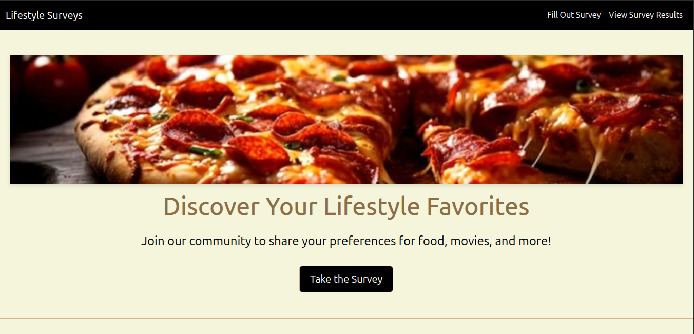
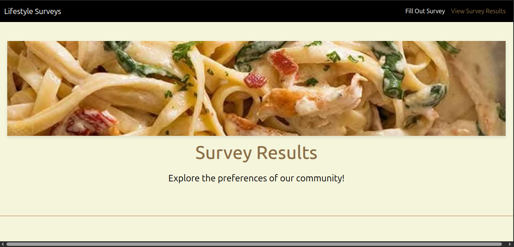
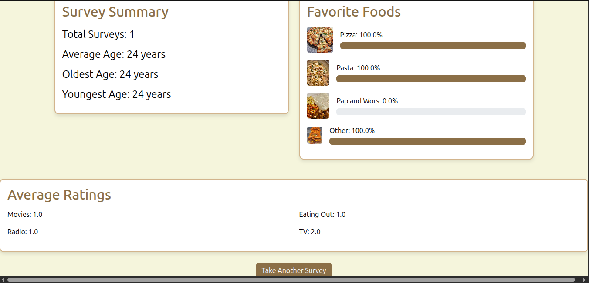
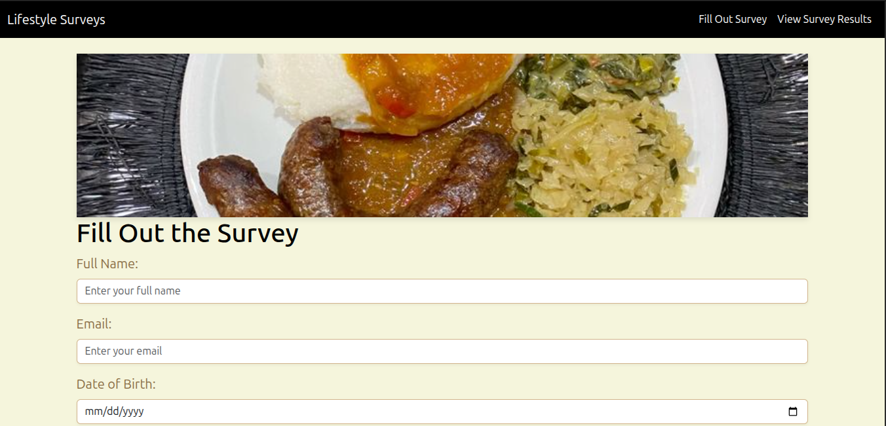
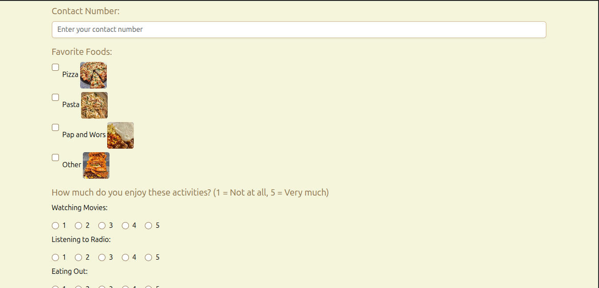

Lifestyle Surveys Web Application
Lifestyle Surveys is a visually stunning web application that allows users to share their preferences for food and lifestyle activities. Built with Flask, Bootstrap, and SQLite, it features a luxurious Burberry-themed interface (beige, tan, brown) with vibrant pages, robust form validation, and dynamic survey results. Designed for a seamless user experience, it’s ideal for collecting and analyzing survey data.
Features

Vibrant UI:
Redesigned homepage, survey, and results pages with varied font sizes (3rem headings, 2rem subheadings, 1.5rem text).
Burberry theme: beige (#F5F5DC), tan (#D2B48C), brown (#8B6F47) for buttons and active links.
Full-width header images (Pizza2.jpg, PaW2.jpg, Pasta2.jpg) with shadows.
Card-based layouts, progress bars for food percentages, and 60x60px food images.

Survey Form:
Collects personal details (name, email, DOB, contact), favorite foods (checkboxes), and lifestyle ratings (1–5).
Brown submit button and radio buttons with tan hover effects.
Client-side validation clears only DOB for invalid ages (5–120 years), retaining other inputs.
Green “Thank you for submitting” message displayed on /survey, no homepage message.
Left-aligned, stacked radio buttons; no phone/email format validation.

Results Page:
Displays total surveys, average/oldest/youngest ages, food percentages, and average ratings.
Progress bars and food icons (40x40px) for visual appeal.
Brown “Take Another Survey” button.

Backend:
Flask handles form submissions via POST to SQLite database (survey.db).
Robust server-side validation and data storage.

Navbar:
Black background with white links, brown active links, and tan hover effects.

Technologies

Frontend: HTML, Bootstrap 5.3.0, CSS (custom style.css)
Backend: Flask (Python), SQLite
Dependencies: Listed in requirements.txt
Images: Pizza2.jpg, Pasta2.jpg, PaW1.jpg, PaW2.jpg in static/

Installation

Clone the Repository:
git clone https://github.com/your-username/lifestyle-surveys.git
cd lifestyle-surveys

Set Up a Virtual Environment:
python -m venv venv
source venv/bin/activate  # On Windows: venv\Scripts\activate

Install Dependencies:
pip install -r requirements.txt

Initialize the Database:
python init_db.py

Run the Application:
python app.py

Open http://localhost:5000 in your browser.

Usage

Homepage (/):

View the vibrant homepage with a pizza header, bold typography, and a “Take the Survey” button.
Navigate via the black navbar to “Fill Out Survey” or “View Survey Results”.

Survey Form (/survey):

Enter personal details, select favorite foods, and rate lifestyle activities.
Submit with the brown button. Invalid DOB clears only that field; other errors show via alert() and red error container.
On success, see a green “Thank you for submitting” message in a card.

Results Page (/results):

View survey statistics in cards, including food percentages with progress bars.
Click the brown “Take Another Survey” button to return to /survey.

Testing

Homepage:

Verify full-width header, font sizes (3rem heading, 1.5rem intro), brown active links.
Click “Take the Survey” to navigate to /survey.

Survey Form:

Submit blank form: Expect alert() and red error container (“All personal details fields are required”).
Enter invalid DOB (e.g., “2025-06-18”): DOB cleared, other fields retained, error shown.
Submit valid form: Green success message, form hidden, no homepage message.
Check brown radio buttons (stacked) and submit button with tan hover.

Results Page:

After submission, view stats, progress bars, and food icons.
If no data, see “No surveys available” card with brown button.
Verify brown active link in navbar.

Database:
ls -l survey.db
sqlite3 survey.db "SELECT * FROM surveys;"
rm survey.db
python init_db.py

Confirm data storage and reset functionality.

Debug:

Open browser console (F12) for JavaScript errors.
Check Flask terminal for server logs.

File Structure
lifestyle-surveys/
├── app.py              # Flask application
├── init_db.py          # Database initialization
├── requirements.txt    # Python dependencies
├── static/
│   ├── style.css       # Custom CSS
│   ├── Pizza2.jpg      # Homepage/survey images
│   ├── Pasta2.jpg      # Results/survey images
│   ├── PaW1.jpg        # Survey/results images
│   ├── PaW2.jpg        # Survey header
├── templates/
│   ├── home.html       # Homepage template
│   ├── survey.html     # Survey form template
│   ├── results.html    # Results template
├── survey.db           # SQLite database (generated)
├── README.md           # Project documentation

Contributing
Contributions are welcome! Please:

Fork the repository.
Create a feature branch (git checkout -b feature/your-feature).
Commit changes (git commit -m "Add your feature").
Push to the branch (git push origin feature/your-feature).
Open a pull request.

Credits
Developer: Naledi Mankgogele Motswiane
Design Inspiration: Burberry color palette
Technologies: Flask, Bootstrap, SQLite
Images:
,    

Screenshot of the vibrant survey page (replace with actual image):
For issues or feedback, contact nmmotswiane@gmail.com.
